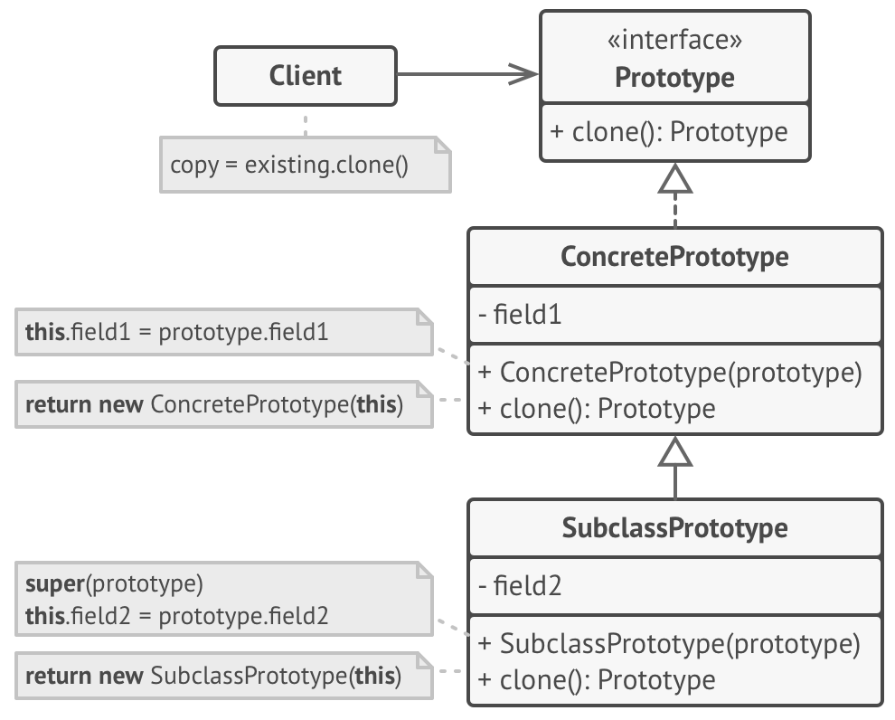

# Prototype
> 코드를 클래스들에 의존시키지 않고 기존 객체들을 복사할 수 있도록 하는 디자인 패턴

## 문제 배경
- 객체를 그대로 복사하고 싶은 경우, 원본 객체의 모든 필드를 살핀 후 해당 값들을 새 객체에 복사하면 된다.
    1. 비공개 필드가 있는 경우, 불가능
    2. 객체의 복제본을 생성하려면 객체의 클래스를 알아야 하므로, 해당 클래스에 의존하게 된다.

## 구성 요소

Prototype < I > : 복제 메서드를 선언한다.
    - clone(): Prototype

ConmcretePrototype : clone 메서드를 구현한다.



## 예시 코드
**in Swift**
```swift
protocol Prototype {
    func clone() -> Self
}

class Apple: Prototype {
    private var name: String

    required init(name: String) {
        self.name = name
    }

    func clone() -> Self {
        return Self(name: self.name)
    }
}

let apple01: Apple = Apple(name: "01")
let apple02 = apple01.clone()
```

**in JAVA**
```java
interface Prototype {
    public Prototype clone();
}

class Apple implements Prototype {
    private String name;

    public Apple(String name) {
        this.name = name;
    }

    public Prototype clone() {
        return new Apple(name);
    }
}

Apple apple01 = new Apple("01");
Apple apple02 = (Apple) apple01.clone();
```
