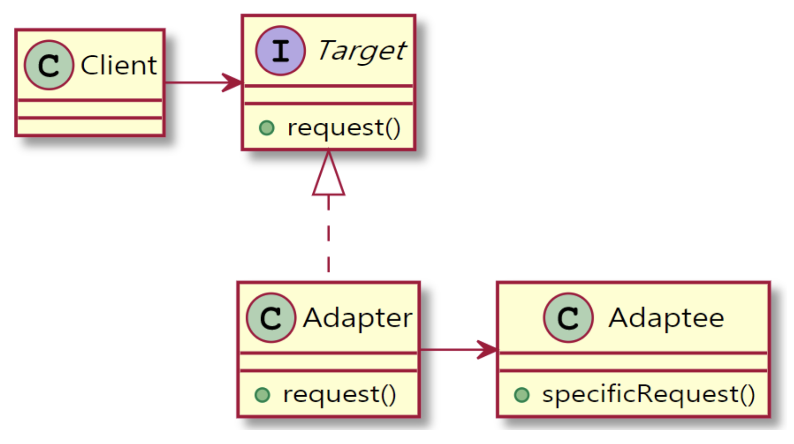

# Adapter
> 클래스의 인터페이스를 클라이언트가 원하는 형태의 또 다른 인터페이스로 변환. 어댑터는 호환되지 않는 인터페이스 때문에 동작하지 않는 클래스들을 함께 동작할 수 있도록 만들어줌

## 구성요소
- Target < I >  : To
- Adapter < C > : Adapter는 Target의 request()에 대해 Adaptee의 인스턴스를 이용하고 적절한 함수를 호출하여 request() 함수를 구현한다.
- Adaptee < C > : From

