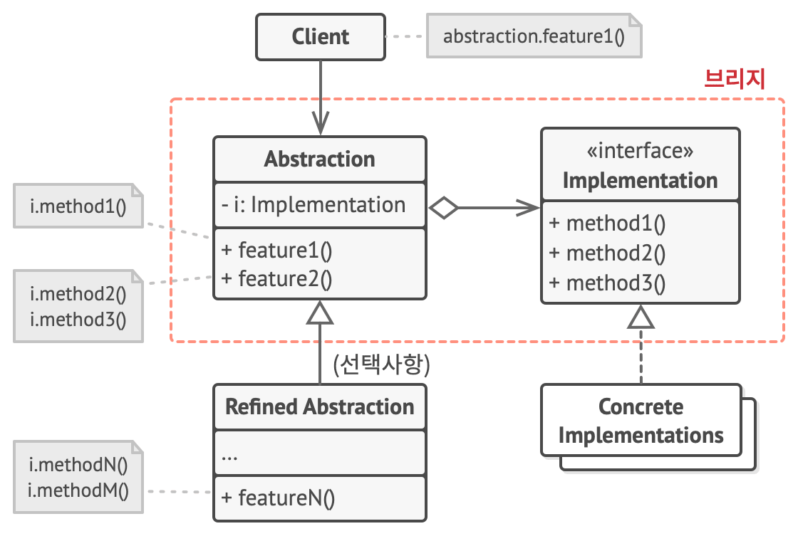

# Bridge
> 큰 클래스 또는 밀접하게 관련된 클래스들의 집합을 두 개의 개별 계층구조​(추상화 및 구현)​로 나눈 후 각각 독립적으로 개발할 수 있도록 하는 구조 디자인 패턴

## 문제 배경
- shape 이라는 클래스가 있고 자식 클래스로 삼각형, 원이 있다고 하자. 여기서 색이 빨강, 파랑이 있으면, 자식 클래스로 파란 삼각형, 빨간 삼각형, ... 4가지의 클래스를 만들어야 한다. 
```java
// 기존 방식의 문제점
class RedCircle {}
class BlueCircle {}
class RedTriangle {}
class BlueTriangle {}
...
```
**클래스 폭발 (class explosion)** : 모양의 종류를 추가하거나 색을 추가할때 마다 매우 많은 클래스를 동시에 만들어야 한다.

## 구성 요소

- Abstraction <>----> Implementation : 포함 관계, Abstraction 를 구현하는 클래스는 Implementation을 멤버변수로 가진다. Implementation이 여러 종류(도형의 태두리 색, 도형의 위치)가 추가 되더라도 Abstraction 를 구현하는 클래스에서는 새로운 인스턴스를 추가만 해주면 된다. 하나의 Implementation에서 종류가 추가되면, 해당 클래스만 만들면 된다.

- Abstraction < C > : 
    - Implementation을 멤버 변수로 가진다.
- (Optional) Refined Abstraction < C > : 
    - Abstraction을 상속하는 클래스
- Implementation < I > : 
    - 구현들에 공통적인 인터페이스를 선언한다.
- Client < C > : 
    - Abstraction객체와 ConcreteImplementation을 연결한다.



## 장점:
- 추상화와 구현이 독립적으로 확장 가능.
- 클래스 폭발 문제 해결.

## 단점:
- 계층 구조가 복잡해질 수 있음.