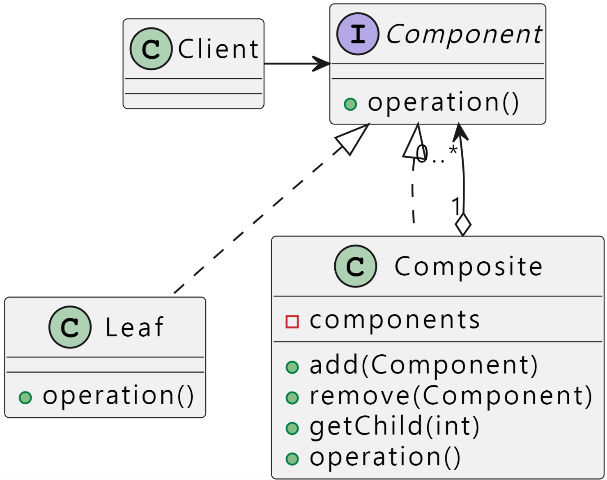

# Composite Pattern
> 부분-전체 계층 구조를 보일 수 있도록 객체들을 트리 구조로 구성. 클라이언트로 하여금 각 객체와 객체의 묶음을 동일하게 다룰 수 있도록 함.

## 문제 배경
- 각각의 객체(개별 객체) 또는 계층 구조로 이루어진 객체 묶음(복합 객체)을 다루어야 함

## 구성 요소

- Component < I > : 공통 인터페이스로, 모든 객체가 구현해야 하는 메서드(operation)를 선언.
- Leaf < C > : 개별 객체, (여러 상속관계의 개별 객체들이 존재할 수 있음.) 실제 작업을 수행.
- Composite < C > : 복합 객체, 자식 노드를 관리하며, 재귀적으로 operation을 호출.

## 장점
- 객체 묶음과 개별 객체를 동일하게 다룰 수 있어 클라이언트 코드가 단순화된다.
- 트리 구조를 활용하여 재귀적으로 동작할 수 있다.

## 단점
- 기능이 너무 다른 클래스들에는 공통 인터페이스를 제공하기 어려울 수 있으며, 어떤 경우에는 컴포넌트 인터페이스를 과도하게 일반화해야 하여 이해하기 어렵게 만들 수 있습니다.