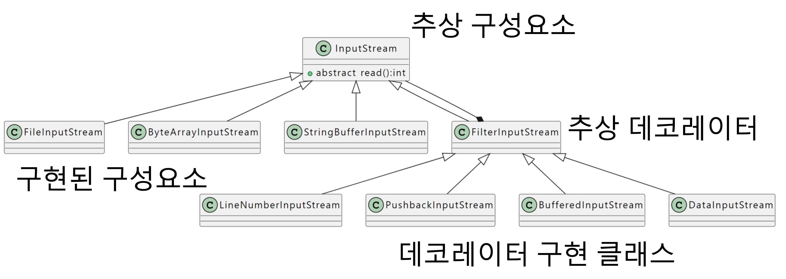

# Decorator Pattern
> 객체에 추가적인 책임을 동적으로 부여함. 데코레이터는 서브클래싱(상속)을 사용하지 않아도 유연하고 융통성 있는 기능 확장을 가능하게 함

## 구성요소
- Component : 각 구성요소는 직접 쓰일 수도 있고 데코레이터로 감싸져서 쓰일 수도 있음 (Interface, Abstract Class로 주로 구현, Class도 가능)

- ConcreteComponent : 새로운 행동을 동적으로 추가

- Decorator : 자신이 장식할 구성요소와 같은 인터페이스 또는 추상 클래스 역할을 함 (Interface, Abstract Class로 주로 구현, Class도 가능)

- ConcreteDecorator : 그 객체가 장식하고 있는 것(데코레이터가 감싸고 있는 Component 객체)을 위한 인스턴스 변수가 있음
```
private component : Component
```

## JAVA 예시 InputStream


InputStream(Component) : 입력에 대해 처리하는 클래스
FileInputStream(Concrete Component) : 구체적으로 어떤 것에 대해 입력을 처리하는지 구현
FilterInputStream(Decoratoe) : InputStream을 꾸며주는 데코레이터
BufferedInputStream : 어떠한 추가 기능을 넣어줄지 구현

대용량의 텍스트를 읽기에 적합한 Buffer를 이용하는 경우. Decorator 패턴을 사용하여 구현. 즉, 기존의 파일 읽는 코드를 Buffer 구현 데코레이터의 매개변수로 할당하는 이유가 바로 이것이다.

## Coffee 예시
Component -> Coffee
ConcreteComponent -> Latte, Tea, Americano, ...
Decorator -> Topping
ConcreteDecorator -> Syrup, Cream, Sugar, Shot, ...