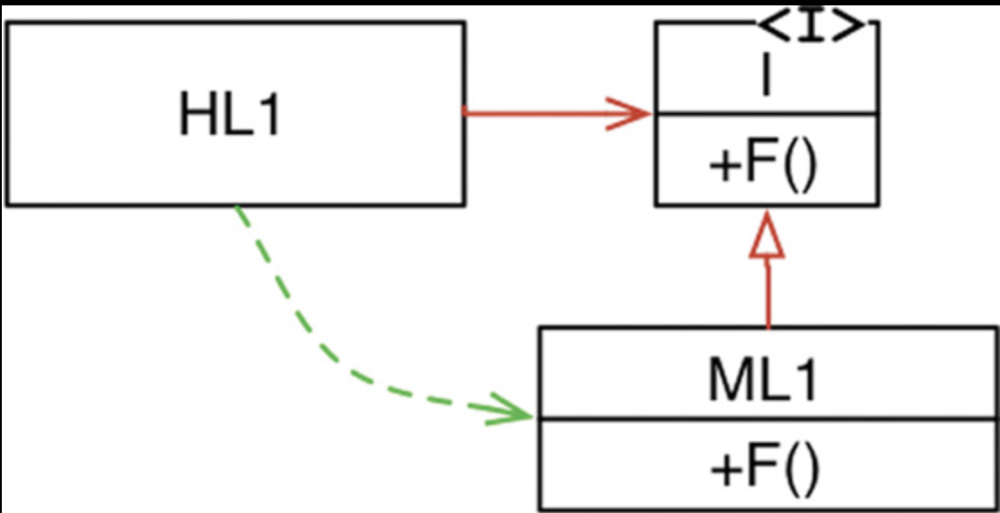

# Strategy Pattern

> 알고리즘을 사용하는 클라이언트로 부터 독립적으로 알고리즘을 바꿔서 적용시킬 수 있도록함.

## Clean Architecture

- 의존성 (Dependency)
파라미터, 리턴값, 지역변수 등으로 다른 객체를 참조하는 것.
ex) A -> B : A가 B를 참조한다.

- 제어 흐름
프로그램에서 실행되는 각 구문, 명령어나 함수가 호출되는 순서.
ex) A - - - > B : A가 실행되고 B가 실행된다.

- 의존성 역전 (DEPENDENCY INVERSION)

제어흐름으로는 고수준에서 저수준으로 제어흐름이 넘어가지만, 의존성은 저수준이 고수준 방향으로 향하여 의존성 역전이 일어나게 된다.