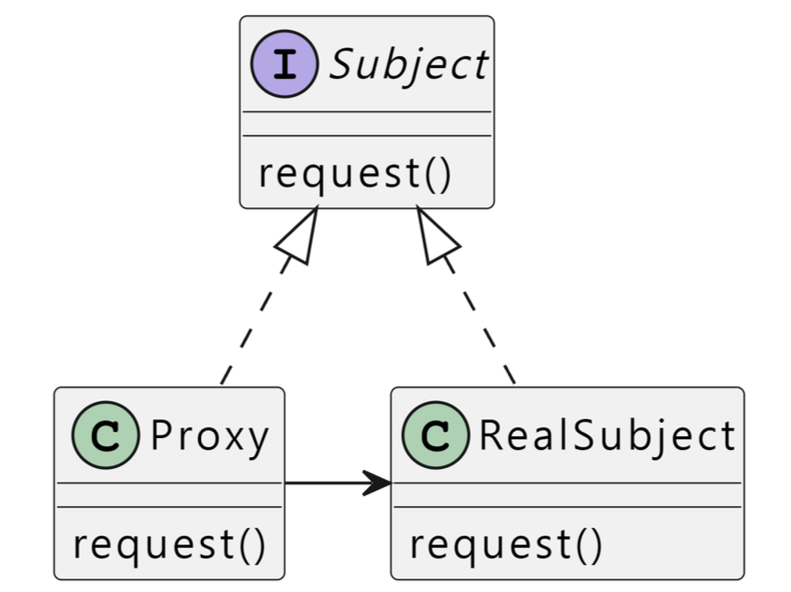

# Proxy
> 다른 객체에 대한 접근을 제어하기 위해 다른 객체에 대한 대리자 또는 자리를 제공

- 요청과 처리의 분리(decoupling) 실제 사용하려는 객체의 부하를 줄임 
- 구현이 복잡해짐

## 문제 배경
- 사용하려는 객체와의 거리가 멀거나 바쁜등 사용하기 어려운 경우

## 구성 요소
- Subject < I >: Proxy와 RealSubject가 구현해야 하는 공통 인터페이스를 정의한다.
    - 클라이언트는 이 인터페이스를 통해 Proxy나 RealSubject와 상호작용합니다.
- Proxy < C >:
    - RealSubject의 인스턴스를 멤버 변수로 가진다.
    - RealSubject에 대한 접근을 제어하고 
    - 필요한 경우에만 RealSubject를 생성하거나 사용한다.
    - Proxy 자체에서 동작을 수행할 수 있음.
-  RealSubject < C >: Subject 인터페이스를 구현한다.
    - 실제 작업을 수행하는 객채이다.
- Client < C >:
    - Subject를 멤버변수로 가진다.
    - 투명성 : Subject가 Proxy인지 RealSubject인지 엄밀히 구분하지 않는다.
    - 메서드를 실행하고 결과만 받는다.

