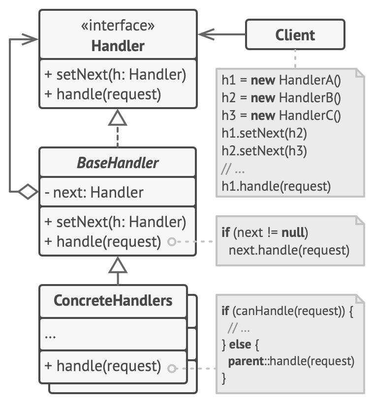

# Chain of Responsibility
> 핸들러들의 체인을 따라 요청을 전달할 수 있게 해주는 패턴.

## 문제 배경

유저를 식별하는 코드를 작성중이라고 생각해 보면, 검증, 로깅, 권한 확인 등의 조건이 늘어날 수록 코드가 복잡해지고, 일부 코드만을 재사용하고 싶어도 어려울 수 있다.

hain of Responsibility 패턴은 검증 조건을 개별 핸들러로 분리하여 코드 복잡성을 줄이고, 특정 검증, 로깅, 권한 로직만 재사용 가능하게 만든다.

## 구성 요소

- `Handler < I >` : 
    - `setNext(h : Handler)` : 다음 핸들러를 추가하는 메서드 선언
    - `handle(request)` : 요청을 처리하는 함수 선언
- `BaseHandler < C >` : 
    - `next: Handler` : 다음 핸들러를 설정하여 체인을 구성
    - `setNext(h: Handler)`: 다음 핸들러를 설정한다.
    - `handle(request)` : 요청을 처리하지 못할 경우 이를 next 핸들러로 전달하는 기본 동작을 제공한다.
- `ConcreteHandler < C >` : 
    - 특정 요청을 처리하거나, 처리하지 못할 경우 다음 핸들러로 전달한다.

