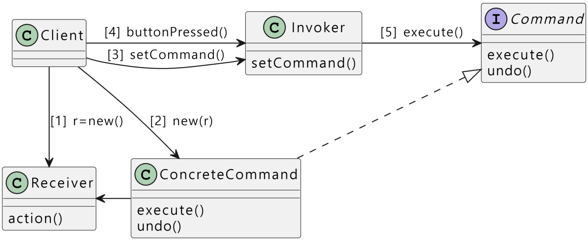

# Command
> 요구사항(요청, 명령)을 객체로 캡슐화시킴. 이를 이용해서 다른 요구사항을 지닌 클라이언트를 매개변수화 시킬 수 있고, 요구사항을 큐에 넣거나 로그로 남길 수 있으며 작업 취소(undo) 기능을 지원할 수도 있음

## 구성 요소
- Command < I >
    - ConcreteCommand 객체 생성
    - 무엇을 요청할지 결정
    - 요청 Command를 Invoker에 넘김
    - undo()
- Invoker < C > : Command < I >
    - 저장
    - 실행
    - (도움을 요청하다. / 요청자)
- Command < I >
    - receiver를 알고 있음
    - receiver의 메소드를 호출
    - receiver의 메소드에서 사용되는 매개변수의 값들은 command에 저장됨
- ConcreteCommand < C >
    - Command 구현
    - 일련의 행동을 특정 리시버하고 연결시킴으로써 요구 사항을 캡슐화 한 것
    - 행동과 리시버를 한 객체에 집어넣고, execute()라는 메소드 하나만 외부에 공개함
    - 메소드 호출을 통해 리시버에서 일련의 작업들이 처리됨
    - 외부에서 볼 때에는 어떤 객체가 리시버 역할을 하는지, 그 리시버에서 실제로 어떤 일을 하는지 알 수 없음. 그냥execute() 메소드를 호출하면 요구 사항이 처리된다는 것 만 알게 됨
    - private Command undoCommand : 전 Command를 저장하는 변수, 동작을 실행할 때 마다 변수에 저장해둠
- Receiver < C >
    - 실제 명령 수행

## Sequence
1. `r = new Receiver()` : Command의 요청에 해당하는 동작을 실행하는 객체 Receiver 생성
2. `cc = new ComcreteCommand(r)` : CC에 Receiver를 넣기
3. `i = new Invoker(); i.setCommand(cc);` : Invoker선언 이후, cc를 Invoker에 세팅
4. `i.buttonPressed();`
5. `cc.execute(); -> r.action();` : Invoker 메서드 호출 → CC 메서드 호출 → Receiver 메서드 호출

Invoker → CC → Receiver 순으로 메서드를 호출함

동작 추가 : 새로운 CC추가, Receiver에 실제 동작하는 메서드 추가
