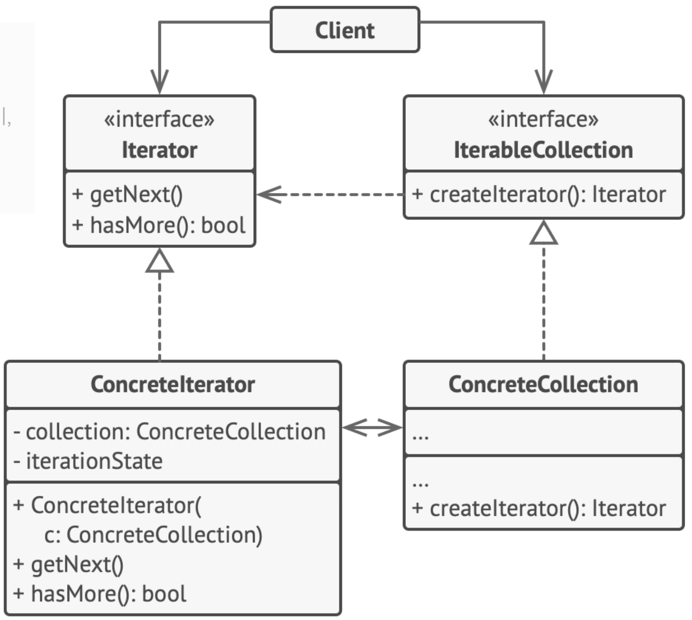

# Iterator
> 컬렉션의 요소들의 기본 표현​(리스트, 스택, 트리 등)​을 노출하지 않고 그들을 하나씩 순회할 수 있도록 하는 디자인 패턴

## 문제 배경
- 어떤 컬렉션에 대해 접근 방법을 알려줘야 하는 경우
- 컬렉션에는 여러가지 유형 (리스트, 트리, ...)이 있고 여러가지 접근 방법이 존재한다.

## 구성 요소
- Iterator : 
    - 컬렉션의 요소들을 하나씩 반복(iterate)하는 데 사용되는 인터페이스
- IteratorCollection
    - JAVA에서는 Iterable 인터페이스를 통해  컬렉션이 반복가능한 객체임을 나타낸다.
- ConcreteIterator
    - ConcreteCollection 인스턴스에 대해 반복 순서를 정하고 반복 가능 여부를 확인할 수 있는 메서드를 정의한다.
- ConcreteCollection
    - Iterator를 반환하는 메서드를 구현한다.

