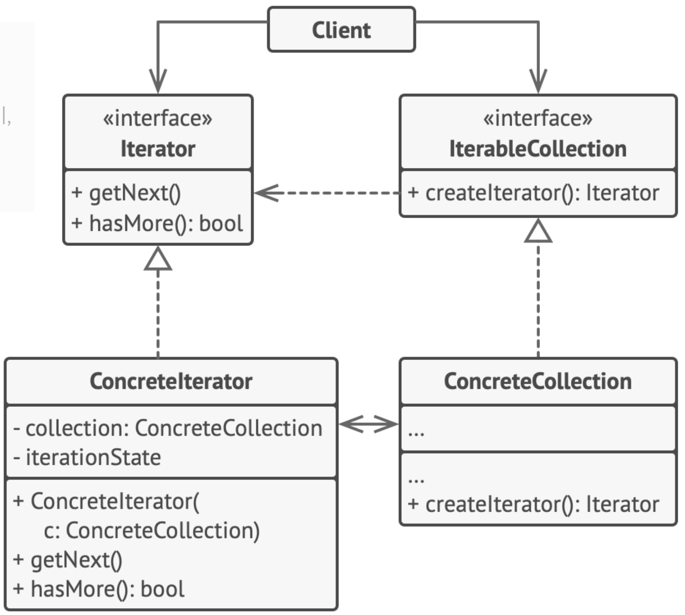

# Iterator
> 컬렉션의 요소들의 기본 표현​(리스트, 스택, 트리 등)​을 노출하지 않고 그들을 하나씩 순회할 수 있도록 하는 디자인 패턴

## 문제 배경
- 어떤 컬렉션에 대해 접근 방법을 알려줘야 하는 경우
- 컬렉션에는 여러가지 유형 (리스트, 트리, ...)이 있고 여러가지 접근 방법이 존재한다.

## 구성 요소
- Iterator : 
    - 컬렉션의 요소들을 하나씩 반복(iterate)하는 데 사용되는 인터페이스
    - getNext()
    - hasMore() : bool
- IteratorCollection
    - JAVA에서는 Iterable 인터페이스를 통해  컬렉션이 반복가능한 객체임을 나타낸다.
    - createIterator() : Iterator
- ConcreteIterator
    - ConcreteCollection 인스턴스에 대해 반복 순서를 정하고 반복 가능 여부를 확인할 수 있는 메서드를 정의한다.
- ConcreteCollection
    - Iterator를 반환하는 메서드를 구현한다.



## in JAVA

```java
class Line<T> implements Iterable<T> {
	private ArrayList<T> data;
	int index = 0;
	
	public Line() { data = new ArrayList<T>(); }
	
	public Iterator<E> iterator() { // Iterable 필수 조건
        return new LineIterator<E>(this); // Iterator를 반환
    }
}
```
```java
class LineIterator<T> implements Iterator<T> {
	private Line<T> line;
    int index;

    public LineIterator(Line<T> oda) {
        this.line = oda;
        index = 0;
    }

    public boolean hasNext() {
        return (index  < line.size() - 1 );
    }
    
	public T next() {
		T o = (T) line.get(index);
		index++;
		return o;
	}
}
```

- Line : Iterable을 구현하는 클래스로 LineIterator를 반환한다.
- LineIterator : Iterator을 구현하는 클래스로, 탐색 방향과 방법을 지정할 수 있다.
    - 인덱스를 1씩 늘려가며 0부터 끝 요소까지 탐색한다.