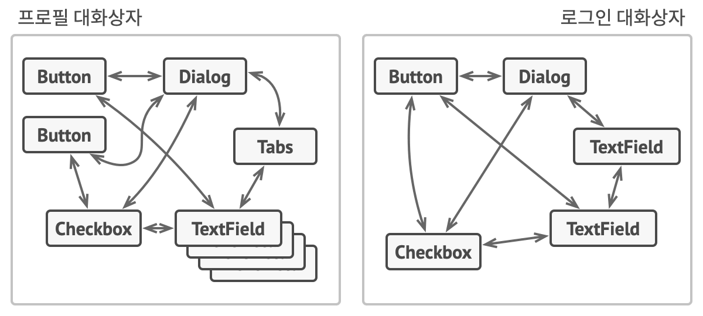
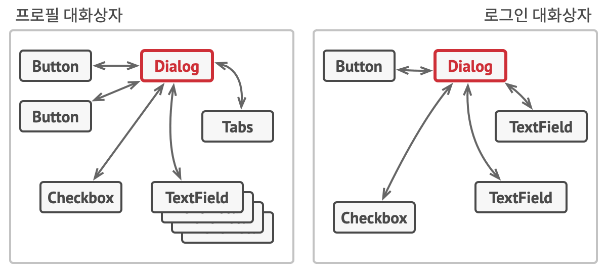

# Mediator
> 객체 간의 복잡한 의존 관계를 줄이고, 객체들이 서로 직접 통신하지 않고 중재자를 통해 통신하도록 만드는 디자인 패턴

## 문제 배경
- 여러 객체가 서로 복잡하게 상호작용하는 경우, 객체 간의 의존성이 증가하여 코드가 복잡해지고 유지보수가 어려워진다.

- 해결
    - 객체 간의 직접적인 의존성을 제거하고, 중재자(Mediator)를 통해 통신하도록 하면 의존성이 감소한다.
    - 객체 간의 상호작용을 캡슐화하여 코드의 가독성과 재사용성을 높일 수 있다.

## 구성 요소
- Mediator < I >: 객체 간의 통신을 조정하는 인터페이스를 정의한다. 
    - notify(sender: Component, event: String)
- ConcreteMediator < C >: Mediator 인터페이스를 구현하며, 객체 간의 상호작용을 실제로 조정한다.
- Component < C >: Mediator와 협력하는 기본 구성 요소. Mediator와 연결되어 있으며, 이벤트를 발생시킬 때 Mediator에 알린다.
- ConcreteComponent < C >: Component를 구체적으로 구현한 클래스들. Mediator를 통해 다른 구성 요소와 상호작용한다.

