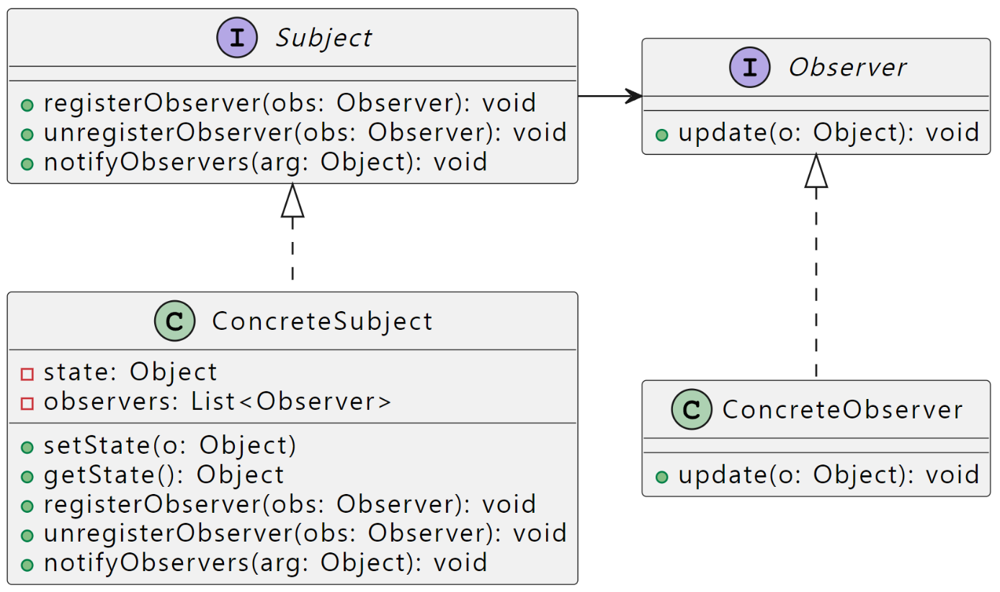
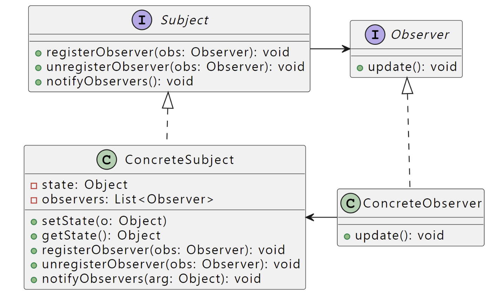

# Observer Pattern
> 객체간 1:N 의존 관계를 정의하고 한 객체 상태가 변경될 경우, 그 객체와 의존 관계에 있는 모든 객체들이 자동으로 알림을 받고 상태를 갱신
- Subject(Publisher) + Observer(Subscriber) = 옵저버 패턴

## vs Poling 
- Push : 이벤트가 발생하면 알려줌
- Polling : 이벤트가 발생했는지 지속적으로 확인 (비효율적)

## Lose Coupling
- 두 객체가 느슨하게 결합되어 있다는 것은, 그 둘이 상호작용을 하긴 하지만 서로에 대해 잘 모른다는 것을 의미함
    - Subject와 Observer간 느슨한 결합이 만들어짐
    - Subject가 Observer에 대해서 아는 것은 특정 인터페이스를 구현한다는 것뿐 (Observer를 구현하는 실제 클래스가 무엇인지, Observer의 역할이 무엇인지 몰라도 됨)
    - 새로운 Observer는 쉽게 추가하거나 제거 가능(실행 중에도 가능)
    - Observer가 새로 생겨도 Subject가 바뀌지 않음
    - Subject와 Observer는 독립적으로 재사용 가능

## Type01
> *Subject Interface* 에서 notifyObservers(arg: Object) 매개변수로 변경된 Object를 Observer로 직접 전달해 주는 경우


## Type02
> *Subject Interface* 에서 notifyObservers() Observer에 단순히 값이 변경되었다는 점만 알려주는 경우


### in JAVA
- Subject (Publisher)
```java
interface Subject {
	public void regist(Observer obs);
	public void deregist(Observer obs);
	public void notify(Object arg); // Object arg is optional
}
```
```java
interface Observer {
	public void update(Object arg); // Depend on notify method's parameter
}
```

## in Swift
UIKit에서 뷰 업데이트 때 사용한 방법이다.
"ButtonPressed" 라는 key와 이벤트를 등록하면, 이 key에 해당하는 Observer들은 알림을 받고 지정한 동작을 수행한다.

전송자 코드

```swift
NotificationCenter.default.post(name: NSNotification.Name("ButtonPressed"), object: nil)
```

구독자 코드

```swift
NotificationCenter.default.addObserver(self, selector: #selector(dataUpdated), name: NSNotification.Name("ButtonPressed"), object: nil)
```

TableView에서 위임한 경우

```swift
@objc func dataUpdated() {
    self.tableView.reloadData()
}
```