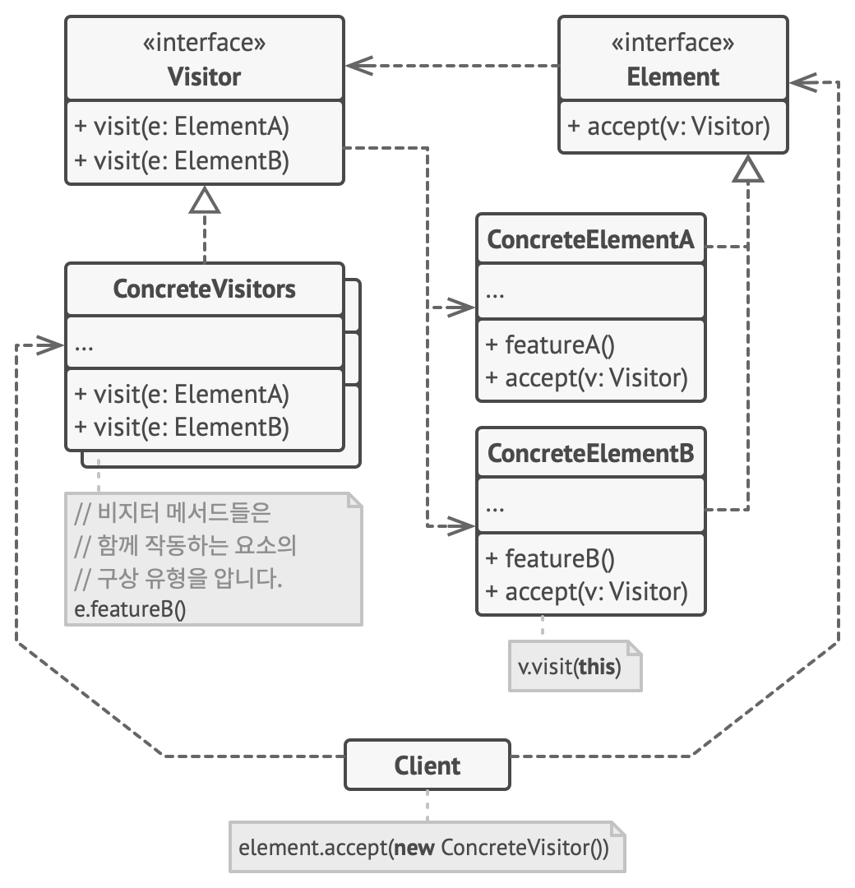

# Visitor
> 알고리즘들을 그들이 작동하는 객체들로부터 분리할 수 있도록 하는 디자인 패턴

## 문제 배경

구현된 객체들에 추가적인 동작을 넣어야 하는 경우가 있다고 가정하자. 문제는 꽤 많은 객체에 메서드를 넣어야 하며, 이 메서드 동작에 대해 요구사항이 자주 변경될 수 있다. 객체의 변화를 최소화 하며 메서드를 추가할 수 있는 방법은?

## 구성 요소

- Visitor < I >: 
    - ConcreteElement를 인수로 갖는 비지터 메서드들의 집합을 선언.
    - ConcreteElement에 따라 동작이 다르다.
    - (Overloading)
    - visit(e: ConcreteElementA)
    - visit(e: ConcreteElementB)
    ...
- ConcreteVisitors < C >: 추가하고 싶은 동작에 따라 여러가지 객체가 선언될 수 있다.
    - 추가된 동작은 ConcreteElement에 따라 동작이 다르게 메서드를 선언한다.
- Element < I >:
    - accept(v: Visitor) Vistor를 수락하는 메서드를 선언.
- ConcreteElementA...Z < C >: 기존에 구현된 요소들
    - v.visit(this)로 호출하여 ConcreteElementA 자신에 대응하는 추가 동작이 실행되게 한다.

