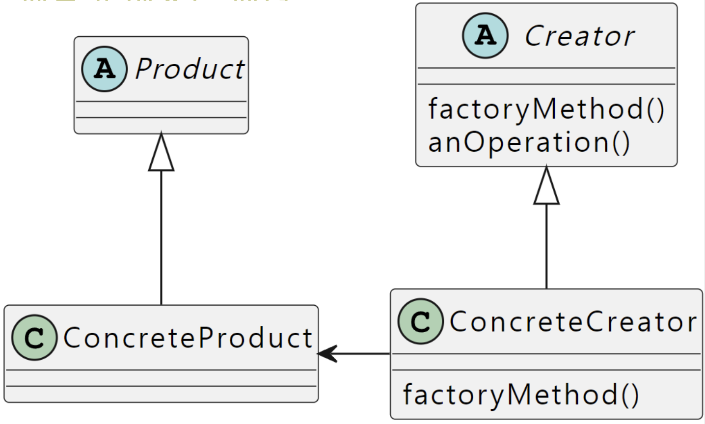

# Factory
> 단일 제품에서 다양한 변형을 생성하는 데 사용

## 구성요소
- Product < I > : 제품은 주로 인터페이스
- ConcreteProduct < C > : 구체적인 제품
- Creator or Factory < AC > : createProduct() 라는 Product를 반환하는 추상 함수를 가지고 있음. 
```
abstract createProduct() : Product
```
- ConcreteFactory < C > : ConcreteProduct를 반환하는 createProduct() 함수를 구현



## in Swift
swift에는 abstract 라는 개념이 존재하지 않는다.